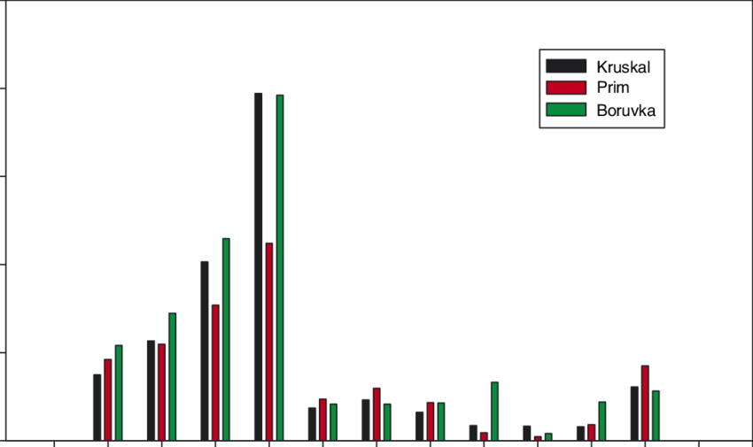

### Comparing between Kruskal's and Prim's

Comparisons :

   - **Other Algorithms :** Prim's and Kruskal's are best possible algorithms to find MST and to complete the sorting process.
   - **Comparision with Kruskal's :** Kruskal have better running time if the number of edges is kept low.
   - While Prim's has better running time if both the number of edges and nodes are kept low 
    So, of course, the best algorithm depends on the graph and the cost of data structure.

### Comparision graphs

