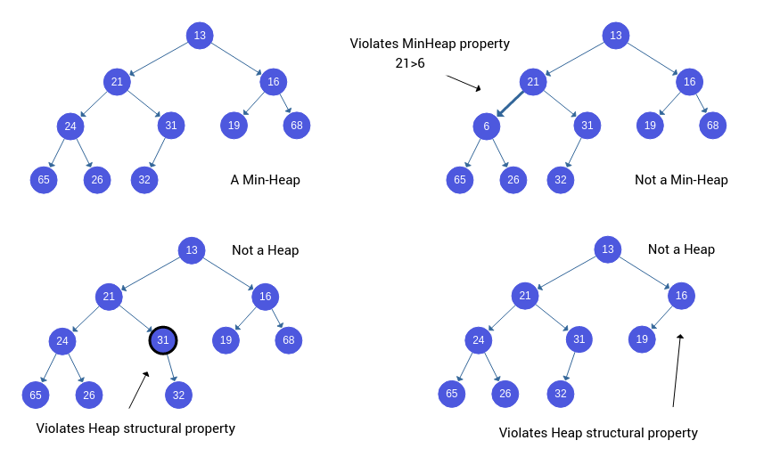
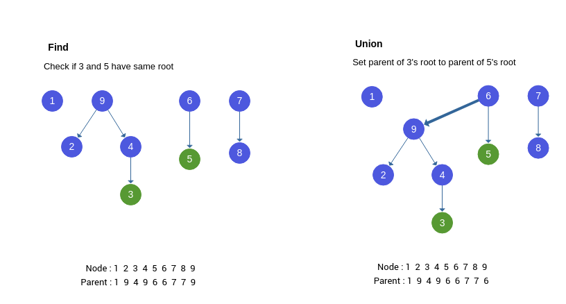

### Min-Heaps

A Min-Heap is a complete binary tree in which the value in each internal node is greater than or equal to the values in the children of that node.

### Examples for Min-Heap and Non Min-Heaps

### Union-Find Algorithm

Union-Find algo has two important components **Find** and **Union**.
In Union-Find all elements of a tree are represented by head element in tree and when two trees are joined, the head of anyone of them is taken as head of new tree.
**Find :** Determine which subset (or) which tree the node belongs to.
**Union :** Join two subsets or two trees into same subset or tree.
When a new node is joined to a differnet tree or subset, both subsets together will be counted as a new subset or new tree such that the whole subset has a common head.
When a new edge is to be added, it has to be checked if both nodes of edge belong to same tree in which case circle is passed.

### Visulalization of Union-Find

