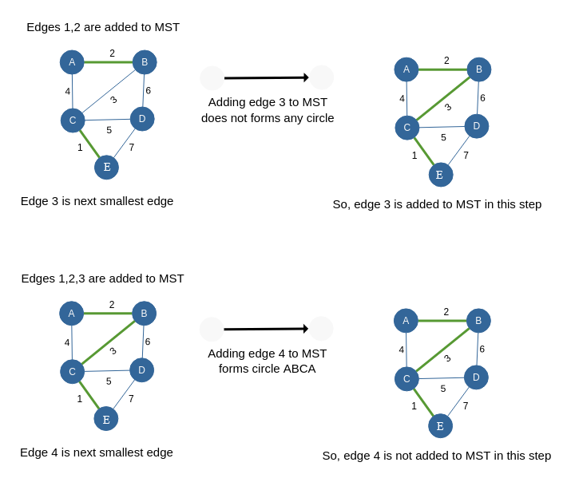
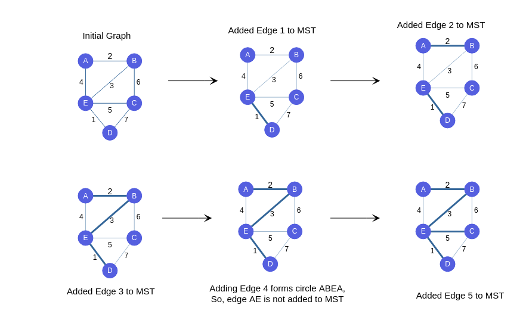

### How can we find MST using Kruskal's?

Kruskal's Algorithm is a classic method for finding the Minimum Spanning Tree (MST) of a graph.

- First, sort all edges of the graph in **increasing** order of their weights.
- Check each edge in sorted order to see if it should be included in the MST.
- If adding an edge would create a cycle (detected using Union-Find), skip it; otherwise, add it to the MST.
- Repeat until the MST contains exactly N-1 edges (where N is the number of vertices).

> **Note:** Each edge is considered only once, and the MST is built by always choosing the smallest available edge that does not form a cycle.

### When should we add an edge to the MST?

### Important Observations

- After each iteration, the smallest available edge that does not form a cycle is added to the MST.
- After N-1 edges are included, the MST is complete.
- Work through each step and see which edges are included.

### Step by Step Process for Kruskal's

> **Tip:** Make sure all vertex names in your diagrams are unique to avoid confusion.
