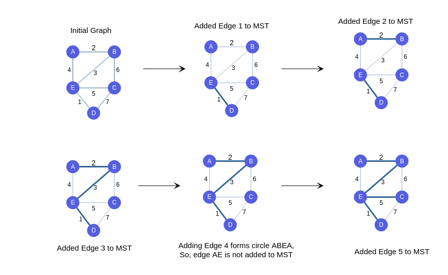

### How can we find MST using Kruskal's ?
In Kruskal's Algorithm, we take the fastest possible approach to create MST.

  -  We first sort the edges of graph in increasing order.
  -  Check the edges in sorted order if they should be in MST or not.
  -  Whenever we see the newly taken edge making circle (checked by Union-find) (refer picture below), we do not keep it in MST or else we will proceed further.
  -  We keep performing the above steps over the array again and again till all the edges are checked.

### When should we add edge to mst?

### Important Observations

Let's take note of a few important observations :

   - From the mentioned algorithm, we can conclude that after the Tth iteration, we will have the edges which should be in MST among T smallest places included in MST.
   - So, After N iterations we will have all edges which are to be in MST included in it.
   - Notice that after including N-1 edges in MST , MST will be finished.
   - Look at the picture below and work out the result of each iteration. See if it matches the picture, and notice which elements keep getting placed correctly after each iteration!

### Step by Step Process for Kruskal's

