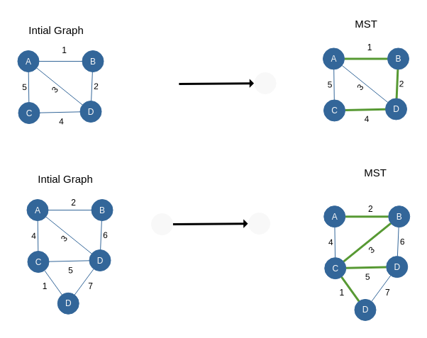

### Estimated Time

15 minutes

### Defining MST

Minimum Spannning Tree (MST) is defined for a weighted graph as the smallest weighted spanning tree Where Spanning Tree is a tree in graph such that it covers all edges of graph.

### MST Visualization

