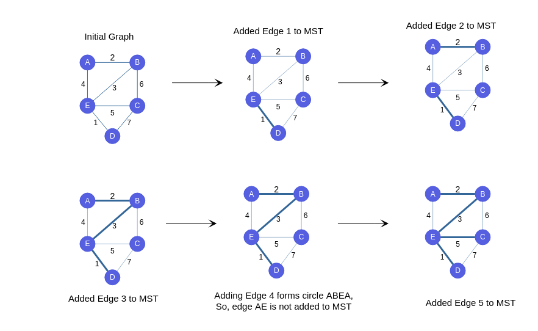

<iframe src="https://www.youtube.com/embed/MqAakVTbLZ0" frameborder="0" allow="autoplay; encrypted-media" allowfullscreen></iframe>

### Concept of Kruskal's Algorithm

Let's have a final look at the consolidated algorithm to find MST of given graph:

   - **STEP 1 :** Sort the given edges
   - **STEP 2 :** Check each edge in sorted order if it forms a cycle with already selected edges. If not Add it to list of MST . If it does move to next edge.
   - **STEP 3 :** Run steps 1 and 2 till v-1 edges are selected (v=no.of.vertices).

### Observations

   - From the mentioned Algo, we can conclude that after the Tth iteration, we will have the edges which should be in MST among T smallest places included in MST.
   - So, After N iterations we will have all edges which are to be in MST included in it.
   - Notice that after including N-1 edges in MST , MST will be finished.
   - Look at the picture below and work out the result of each iteration. See if it matches the picture, and notice which elements keep getting placed correctly after each iteration!

### Iteration by Iteration Visualization of Kruskal's

