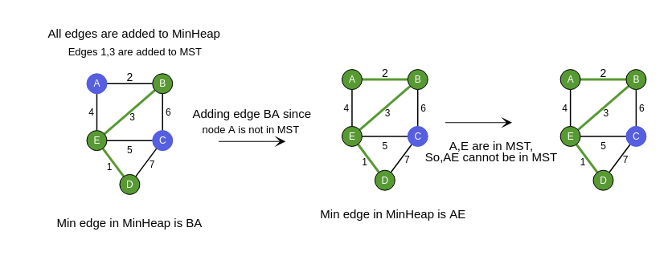

### How can we find MST using Prim's?
In Prim's algorithm, we take the fastest possible approach to create MST.

   - We first choose a random node of graph and add it to set of nodes which include in MST so far.
   - Add the edge weights of edges from newly added node in MST to its adjacent nodes which are not in MST so far.
   - Add the smallest weighted edge from Min-Heap into MST and include the respective node into MST.
   - We keep performing the above steps over the array again and again till all the edges checked.

### Which edge should we add edge to MST?

### Important Observations

From the mentioned algorithm, we can conclude that:

  -  After the Tth iteration, we will have T edges and T+1 nodes in MST.
  -  So, after N iterations we will have all edges which are to be included in MST.
  - Look at the picture below and work out the result of each iteration. See if it matches the picture, and notice which elements keep getting placed correctly after each iteration!

### Step by Step Process for One Iteration

