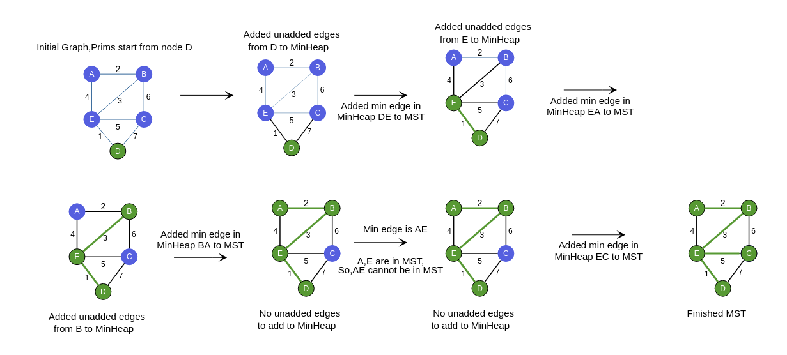

### How can we find MST using Prim's?
In Prim's algorithm, we take the fastest possible approach to create MST.

1. We first determine an arbitrary vertex as the starting vertex of the MST.
2. Follow steps 3 to 5 till there are vertices that are not included in the MST (known as fringe vertex).
3. Find edges connecting any tree vertex with the fringe vertices.
4. Find the minimum among these edges.
5. Add the chosen edge to the MST if it does not form any cycle.
6. When all the vertices are included in the tree, the tree we have is the required MST.

### Which edge should we add edge to MST?

### Important Observations

From the mentioned algorithm, we can conclude that:

  -  After the Tth iteration, we will have T edges and T+1 nodes in MST.
  -  So, after N iterations we will have all edges which are to be included in MST.
  - Look at the picture below and work out the result of each iteration. See if it matches the picture, and notice which elements keep getting placed correctly after each iteration!

### Step by Step Process for One Iteration

